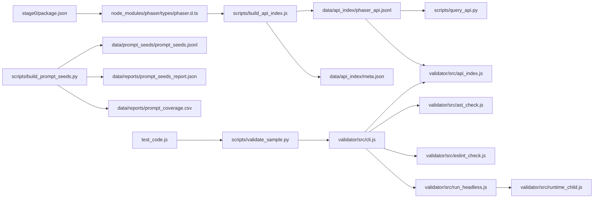

# Stage0 流程设计（文件视角）

本文件从“**文件与产物流向**”的角度，梳理 `stage0/` 的整体流程设计。目标是解释每个关键文件在**输入/处理/输出/下游消费**中的位置。

---

## 1. 总体流向（按文件链路）



---

## 2. 关键文件与职责（输入/输出/下游）

| 文件 | 角色 | 主要输入 | 主要输出/下游 |
|---|---|---|---|
| `stage0/package.json` | 安装 Phaser（获取 `.d.ts`） | npm 安装 | `node_modules/phaser/types/phaser.d.ts` |
| `scripts/build_api_index.js` | 解析 `phaser.d.ts` 生成 API 索引 | `phaser.d.ts` | `data/api_index/phaser_api.jsonl`、`data/api_index/meta.json` |
| `data/api_index/phaser_api.jsonl` | API 索引（JSONL） | 由 `build_api_index.js` 生成 | 被 `query_api.py` 检索、被 validator 用于命中/缺失判定 |
| `scripts/query_api.py` | BM25 检索 API（用于 Prompt 注入/人工检索） | `data/api_index/phaser_api.jsonl` | stdout JSON（Top‑K API 结果） |
| `scripts/build_prompt_seeds.py` | 生成 Prompt 种子 + 覆盖率报告 | 模板/参数维度 | `data/prompt_seeds/prompt_seeds.jsonl`、`data/reports/*` |
| `scripts/validate_sample.py` | Python 包装 validator | 代码文件 + API 索引 | 结构化 JSON（pretty 输出） |
| `validator/src/cli.js` | 验证器总入口 | 代码/索引/可选运行时 | JSON 结构化信号 |
| `validator/src/ast_check.js` | AST 检测 + API 候选提取 | JS 源码 | `signals`、`api_candidates`、危险用法 |
| `validator/eslint.config.js` + `validator/src/eslint_check.js` | 轻量 ESLint 安全/错误检查 | JS 源码 | lint 结果 |
| `validator/src/api_index.js` | 加载索引 `symbol_id` 集合 | `phaser_api.jsonl` | `Set(symbol_id)` |
| `validator/src/run_headless.js` + `validator/src/runtime_child.js` | 运行时（可选） | JS 源码 | runtime 结果与信号 |
| `test_code.js` | 示例 Phaser 代码 | - | 用于 `validate_sample.py` 快速验证 |

---

## 3. 子流程拆解（按文件链路）

### 3.1 API 索引构建链

**目的**：从 `phaser.d.ts` 提取“够用”的结构化 API 记录，为 Prompt 注入与 API 存在性校验服务。

1. `stage0/package.json` 安装 `phaser` → 产出 `node_modules/phaser/types/phaser.d.ts`  
2. `scripts/build_api_index.js` 解析 `.d.ts` → 写出：
   - `data/api_index/phaser_api.jsonl`（每行一个 API 记录）
   - `data/api_index/meta.json`（版本/统计/构建时间）
3. 下游消费：
   - `scripts/query_api.py`：检索 Top‑K API  
   - `validator/src/api_index.js`：加载 `symbol_id` 集合，用于命中/缺失判定

**文件契约关键点**：  
`build_api_index.js` 会生成统一格式的 `symbol_id`（如 `Owner#method`、`Owner.name`），`validator/src/ast_check.js` 按同一规则构造 API 候选，从而实现“弱一致性”存在性校验。

---

### 3.2 Prompt 种子生成链

**目的**：构建稳定、可复现的 Prompt 任务池，供蒸馏/SFT/评估使用。

1. `scripts/build_prompt_seeds.py` 使用模板 + 参数化维度生成任务  
2. 产出：
   - `data/prompt_seeds/prompt_seeds.jsonl`
   - `data/reports/prompt_seeds_report.json`
   - `data/reports/prompt_coverage.csv`

**说明**：  
该脚本内部按 `easy/medium/hard` 比例生成，并通过 `--seed` 固定随机性，确保相同配置下可复现。

---

### 3.3 API 检索链（Prompt 注入）

**目的**：为教师 prompt 或人工检查提供 API Top‑K 候选。

- `scripts/query_api.py` 读取 `data/api_index/phaser_api.jsonl`  
  - 将 `symbol_id/owner/name/signature/kind/tags` 拼接成检索文本
  - 内置少量中英文关键词扩展（如“拖拽/粒子/摄像机”等）

---

### 3.4 代码验证链（validator）

**目的**：对生成的 Phaser 代码输出稳定的结构化信号（静态 + 可选运行时）。

**入口**：`validator/src/cli.js`

1. **AST 阶段**：`validator/src/ast_check.js`  
   - 解析源码（Babel）  
   - 提取结构信号：`new Phaser.Game`、`scene`、`preload/create/update`  
   - 采集 API 候选（`Phaser.*`、`this.*` 链）  
   - 拦截危险用法（`eval/new Function`、`require/import` 敏感模块）

2. **ESLint 阶段**：`validator/eslint.config.js` + `validator/src/eslint_check.js`  
   - 轻量安全/明显错误检查（`no-undef/no-eval/no-new-func/no-restricted-imports`）

3. **API 索引阶段**：`validator/src/api_index.js`  
   - 加载 `data/api_index/phaser_api.jsonl` → `Set(symbol_id)`  
   - 计算命中/缺失：`api_usage.hits/misses`  
   - 结合 `must_use_apis` 判定 `api_ok`

4. **运行时阶段（可选）**：`validator/src/run_headless.js` + `validator/src/runtime_child.js`  
   - 子进程沙箱执行  
   - best‑effort DOM/canvas 注入（`jsdom`/`canvas` 可选依赖）  
   - 监控 `Phaser.Game` 是否成功创建（`runtime_ok`）

**输出**：`validator/src/cli.js` 最终输出 JSON，核心字段包括：
`parse_ok / lint_ok / api_ok / runtime_ok / errors / warnings / api_usage / signals / runtime`

**Python 包装**：  
`scripts/validate_sample.py` 调用 CLI，并将输出 pretty 化，便于后续 Python 训练管线复用。

---

## 4. 产物与契约要点

- **API 契约**：`build_api_index.js` 与 `ast_check.js` 通过 `symbol_id` 对齐。  
  - 方法：`<Owner>#<method>`  
  - 属性/常量/namespace 函数：`<Owner>.<name>`
- **产物稳定性**：所有核心输出集中在 `stage0/data/`，并通过 `.gitkeep` 保证目录存在。

---

## 5. 版本与依赖一致性（文件级提示）

- `stage0/package.json` 依赖 `phaser`（用于 `.d.ts`）  
- `stage0/validator/package.json` 依赖 `phaser`（用于运行时验证）  

> 当前仓库中两处 Phaser 版本范围不同：  
> `stage0/package.json` 为 `^3.90.0`，`stage0/validator/package.json` 为 `^3.80.0`。  
> 若追求 API 索引与运行时严格一致，建议对齐版本。

---

## 6. 端到端最小链路（文件对应命令）

```bash
# 1) 生成 API 索引
node scripts/build_api_index.js \
  --dts node_modules/phaser/types/phaser.d.ts \
  --out data/api_index/phaser_api.jsonl \
  --meta data/api_index/meta.json

# 2) 生成 Prompt 种子库 + 报告
python scripts/build_prompt_seeds.py

# 3) 验证单样本（静态为主）
python scripts/validate_sample.py --code-file test_code.js --skip-runtime
```

---

## 7. 相关文档入口（文件级索引）

- `stage0/README.md`：快速开始 + 高层说明  
- `stage0/DETAILS.md`：详细设计与数据格式  
- `stage0/scripts/README.md`：脚本清单  
- `stage0/validator/README.md`：验证器使用说明
