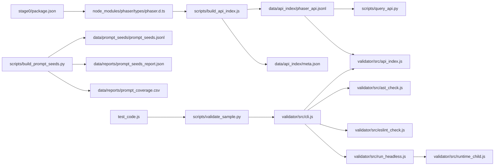

<!-- Stage0 快速开始与高层说明。 -->
# Stage 0（基础设施准备）

`stage0/` 是整个训练工程的“地基层”，目标是把后续阶段（SFT/GRPO/评估）依赖的三件事做成**可复现的离线产物**：

1) **Phaser3 API 索引（JSONL）**：从 `phaser.d.ts` 提取结构化记录，用于 Prompt 注入与 API 弱校验  
2) **Prompt 种子库（JSONL，默认 2000 条）**：覆盖 Phaser3 核心模块与难度分布  
3) **代码验证器（validator）**：静态（Babel AST + ESLint + API index）+ 可选运行时（HEADLESS）

---

## 目录概览

```text
stage0/
├─ data/                 # 可重复生成的产物（api_index / prompt_seeds / reports）
├─ scripts/              # 离线脚本（构建索引/种子/验证）
├─ validator/            # Node 验证器工程
├─ test_code.js          # 示例 Phaser 代码
├─ DETAILS.md            # 详细设计与数据格式
├─ FLOW.md               # 文件流向与流程设计
└─ README.md             # 本文（快速开始）
```

---

## 流程关系（文件链路）



关键链路：
- **API 索引**：`phaser.d.ts` → `build_api_index.js` → `data/api_index/*`
- **Prompt 种子**：`build_prompt_seeds.py` → `data/prompt_seeds/*` + `data/reports/*`
- **代码验证**：`validate_sample.py` → `validator/src/cli.js` → AST/ESLint/API/Runtime

---

## 文件说明（按路径）

> 说明范围：以下列出 `stage0/` 下的**项目文件与数据产物**。`node_modules/` 内为 npm 自动生成的第三方依赖文件，数量巨大，故不逐一展开。

### 顶层文件

- `stage0/README.md`：快速开始与高层说明（本文）。
- `stage0/DETAILS.md`：详细设计、数据格式与契约说明。
- `stage0/FLOW.md`：文件流向与流程设计（Mermaid + 表格）。
- `stage0/package.json`：安装 Phaser 以获取 `phaser.d.ts`。
- `stage0/package-lock.json`：锁定依赖版本。
- `stage0/test_code.js`：示例 Phaser 代码，用于快速验证。
- `stage0/node_modules/`：安装后的第三方依赖（自动生成）。
- `stage0/.DS_Store`：macOS 目录元数据（可忽略/可删除）。

### data/（可复现离线产物）

- `stage0/data/api_index/phaser_api.jsonl`：Phaser API 索引（JSONL）。
- `stage0/data/api_index/meta.json`：索引元信息（版本/统计/构建时间）。
- `stage0/data/api_index/.gitkeep`：保留空目录用占位文件。
- `stage0/data/prompt_seeds/prompt_seeds.jsonl`：Prompt 种子库（JSONL）。
- `stage0/data/prompt_seeds/.gitkeep`：保留空目录用占位文件。
- `stage0/data/reports/prompt_seeds_report.json`：种子库统计摘要。
- `stage0/data/reports/prompt_coverage.csv`：模块/难度覆盖率表。
- `stage0/data/reports/.gitkeep`：保留空目录用占位文件。
- `stage0/data/.DS_Store`：macOS 目录元数据（可忽略/可删除）。

### scripts/（离线脚本）

- `stage0/scripts/README.md`：脚本清单与用途概览。
- `stage0/scripts/build_api_index.js`：从 `phaser.d.ts` 构建 API 索引。
- `stage0/scripts/query_api.py`：对 API 索引做检索（BM25）。
- `stage0/scripts/build_prompt_seeds.py`：生成 Prompt 种子与覆盖率报告。
- `stage0/scripts/validate_sample.py`：调用 validator 的单样本验证封装。

### validator/（代码验证器）

- `stage0/validator/README.md`：validator 使用说明。
- `stage0/validator/package.json`：validator 依赖与脚本。
- `stage0/validator/package-lock.json`：锁定 validator 依赖版本。
- `stage0/validator/eslint.config.js`：ESLint 配置（安全/错误规则）。
- `stage0/validator/src/cli.js`：验证器入口，串联 AST/ESLint/API/Runtime。
- `stage0/validator/src/ast_check.js`：AST 解析、结构信号与 API 候选提取。
- `stage0/validator/src/eslint_check.js`：ESLint lintText 封装。
- `stage0/validator/src/api_index.js`：加载 API 索引 `symbol_id` 集合。
- `stage0/validator/src/run_headless.js`：子进程运行 runtime（可选）。
- `stage0/validator/src/runtime_child.js`：vm 沙箱 + DOM/canvas stub + Phaser.HEADLESS。
- `stage0/validator/node_modules/`：安装后的第三方依赖（自动生成）。

---

## 快速开始（端到端最小链路）

> 以下命令默认在 `stage0/` 目录执行。

### 1) 安装 Phaser（拿到 `phaser.d.ts`）

```bash
npm i
```

### 2) 构建 API 索引（JSONL）

```bash
node scripts/build_api_index.js \
  --dts node_modules/phaser/types/phaser.d.ts \
  --out data/api_index/phaser_api.jsonl \
  --meta data/api_index/meta.json \
  --phaser-version 3.90.0
```

### 3) 生成 Prompt 种子库（默认 2000）

```bash
python scripts/build_prompt_seeds.py \
  --count 2000 \
  --seed 42 \
  --out data/prompt_seeds/prompt_seeds.jsonl \
  --report-json data/reports/prompt_seeds_report.json \
  --coverage-csv data/reports/prompt_coverage.csv
```

### 4) 安装 validator 依赖

```bash
cd validator
npm i
cd ..
```

### 5) 验证单样本（静态为主）

```bash
node validator/src/cli.js \
  --code-file test_code.js \
  --api-index data/api_index/phaser_api.jsonl \
  --skip-runtime
```

或使用 Python 包装（pretty 输出）：

```bash
python scripts/validate_sample.py --code-file test_code.js --skip-runtime
```

---

## 产物一览（可复现离线数据）

- `data/api_index/phaser_api.jsonl`：Phaser API 索引（JSONL）
- `data/api_index/meta.json`：索引元信息（版本/统计/时间）
- `data/prompt_seeds/prompt_seeds.jsonl`：Prompt 种子库
- `data/reports/prompt_seeds_report.json`：种子库统计摘要
- `data/reports/prompt_coverage.csv`：模块/难度覆盖率表

---

## 注意事项

- **版本一致性**：建议让 `stage0/package.json` 与 `stage0/validator/package.json` 的 Phaser 版本尽量一致，避免“索引里有/运行时没有”的噪声。  
- **运行时可选**：HEADLESS 运行时依赖 `jsdom/canvas`（已在 `validator/` 的 `optionalDependencies` 中），可按需安装。

---

## 相关文档入口

- `stage0/DETAILS.md`：详细设计与数据格式  
- `stage0/FLOW.md`：流程与文件流向  
- `stage0/scripts/README.md`：脚本清单  
- `stage0/validator/README.md`：validator 使用说明
